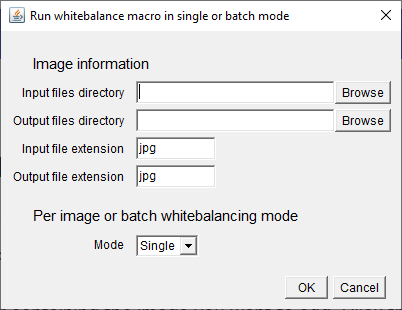

# GreenLeafVI
Repository for the FIJI GreenLeafVI plugin which aims to extract RGB data from imaged plant tissue to estimate the chlorophyll content using different vegetation indices.

## Installation of GreenLeafVI
1. Before the installation of GreenLeafVI, the installation of FIJI is required. FIJI can be downloaded from https://fiji.sc/.
2. To install GreenLeafVI, open FIJI, navigate to **Help --> Update** and select **Manage Update Sites**. From here, navigate to GreenLeafVI and set as **Active**. Click **Apply and Close** and close the ImageJ Updater. Restart FIJI and you can find the plugin under **Plugins --> GreenLeafVI**.

If GreenLeafVI cannot be found in the **Manage Update Sites** menu, click **Add Unlisted Site**, type GreenLeafVI under **Name** and type **https://sites.imagej.net/GreenLeafVI/**. Click **Apply and Close** and restart FIJI. The plugin should be under **Plugins --> GreenLeafVI**.

## Usage
RGB vegetation indices have been used in many species to estimate the relative chlorophyll content. Our plugin has been tested on leaf tissue of *Arabidopsis thaliana* (Arabidopsis), *Nicothiana benthamiana* (Tobacco), *Solanum lycopersicum* (Tomato) and *Lactuca sativa* (Lettuce). The normalized red index was the best predictor of chlorophyll content in all species, apart from lettuce. For lettuce the Green:Red ratio index performed best. For other species, we recommend comparing the available vegetation indices to other chlorophyll quantification methods. Moreover, we recommend using the **whitebalancing** and **segmentation** options before extracting RGB values, but direct RGB value extraction is possible provided that variation between images is minimal and the desired object is clearly distinguishable from the background.

### Image acquisition
Our method requires images in a format that contains RGB data and can be read by FIJI. Moreover, it's important to minimize the variation between images by imaging in constant lighting. Even though our plugin allows for post-imaging **whitebalancing**, most cameras provide this option themself and may result in more accurate data analysis. Finally, our method requires objects to be clearly distinguishable from the background. Our **segmentation** method has been tested on images using either a white or black background.

### Whitebalancing
Whitebalancing is an image transformation method that can help make different images more comparable to each other. We provide a script in which the user selects a white reference surface and its RGB value is compared to perfect RGB white (#255,#255,#255). The ratio of the selected surface RGB and perfect white RGB values is used to transform the red, green and blue channel separately, followed by merging of each colour channel to end with a more colour balanced image.

#### Step-by-step whitebalancing
1. **Input files directory**: Select the directory with images you want to whitebalance.
2. **Output files directory**: Select the directory you want to save your images in.
3. **Input file extension**: Select the file extension of your input images (This is case-sensitive).
4. **Output file extension**: Select the file extension of your output images (This is case-sensitive).
5. **Mode**: Either; **Single** for per image whitebalancing, or **Batch** for whitebalancing of the whole input directory.

**Single:** The script will open each image individually and requires users to **select** a white reference area using the rectangle tool and **click** *ok*. Repeat this for each subsequent image.

**Batch:** The script will ask to open a reference image. **Select** a white reference area using the rectangle tool and **click** *ok*. The same pixel area will be used as reference for each image in the input directory.

### Segmentation
To accurately measure the mean RGB values for the desired objects, it is recommended to remove the background of each image. The segmentation script creates a duplicate image and uses the FIJI **Image --> Adjust --> Color threshold** function to select desired objects based on minimum and maximum HSB (Hue, saturation and brightness) values. A mask is created and the selection is overlayed on the original image, followed by background removal.

#### Step-by-step segmentation

1. **Input files directory**: Select the directory with images you want to segment.
2. **Output files directory**: Select the directory you want to save your images in.
3. **Input file extension**: Select the file extension of your input images (This is case-sensitive).
4. **Output file extension**: Select the file extension of your output images (This is case-sensitive).
5. **Minimum object area**: Define the minimum size of your object in pixels.
6. **HSB values**: Provides two options; **New** requires users to fill in their own HSB values (Hue minimum, Hue maximum, Saturation minimum, Saturation maximum, Brightness minimum, Brightness maximum) *or* **Import** which asks users to import a *.csv* table with pre-defined HSB minima and maxima.
7. **Save**: Saves the used HSB values as a table in *.csv* format in the input directory (only when the option **New** was used).

### Vegetation index extraction
The final step includes splitting the RGB image into its three channels and selecting the region-of-interest (roi), based on the object's blue channel value. Subsequently, the **mean grey value** is extracted for each object in each channel individually. These grey values are entered in a table with a number of vegetation indices and the x and y coördinates of each object in a tidy format. The table is opened within FIJI and saved in the input directory as *.csv* format.

#### Step-by-step Vegetation Index extraction

1. **File extension**: Select the file extension of your input images (This is case-sensitive).
2. **Background value (8-bit)**: Select the minimum grey value of your object blue channel (if segmented set at 1).
3. **Max intensity value (8-bit)**: Select the maximum grey value of your object blue channel (if segmented set at 255).
4. **Minimum object size**: Define the minimum size of your object in pixels.

#### Overview Vegetation index output
|Column Name|Definition*|
|-----------|----------|
|Image name |Image name|
|Roi|The roi number within the image selected|
|Area|The roi area in number of pixels|
|Red_mean|Mean red grey value measured|
|Red_min|Minimum red grey value measured|
|Red_max|Maximum red grey value measured|
|Red_median|Median red grey value measured|
|Green_mean|Mean green grey value measured|
|Green_min|Minimum green grey value measured|
|Green_max|Maximum green grey value measured|
|Green_median|Median green grey value measured|
|Blue_mean|Mean blue grey value measured|
|Blue_min|Minimum blue grey value measured|
|Blue_max|Maximum blue grey value measured|
|Blue_median|Median blue grey value measured|
|GR_ratio|G/R|
|RG_ratio|R/G|
|Kawashima|(R-B)/(R+B)|
|NDI**|(Rn-Gn)/(Rn+Gn+0.01)|
|GLI|(2G-R-B)/(2G+R+B)|
|Red_norm|R/(R+G+B)|
|Green_norm|G/(R+G+B)|
|Blue_norm|B/(R+G+B)|
|Woebbecke|(G-B)/(R-G)|
|Top left x|Top left most x-axis pixel value of roi|
|Top left y|Top left most y-axis pixel value of roi|
|Bottom right x|Bottom right most x-axis pixel value of roi|
|Bottom right y|Bottom right most y-axis pixel value of roi|

*R = mean red grey value, G = mean green grey value, B = mean blue grey value
**Rn = Red_norm, Gn = Green_norm, Bn = Blue_norm 

## Citation
Manuscript is currently in preparation. Please don't publish anything without our permission.

## Contributors
Thalia Luden  
Jelmer van Lieshout  
Joost Willemse
